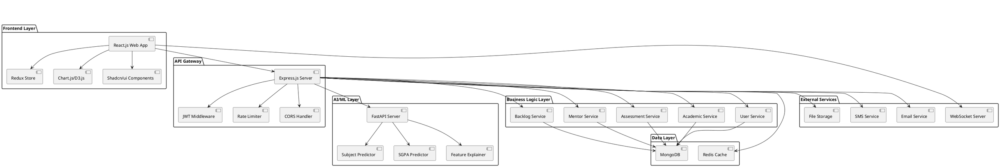
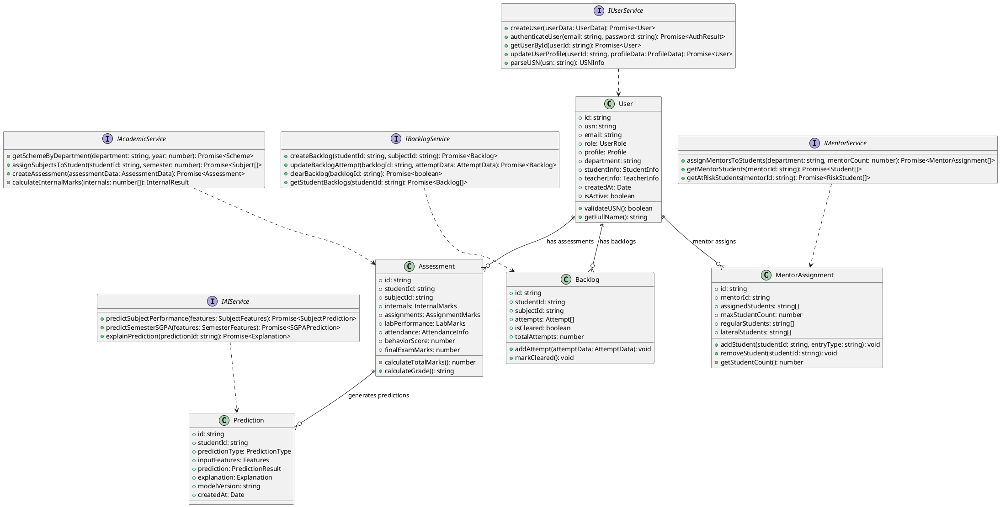
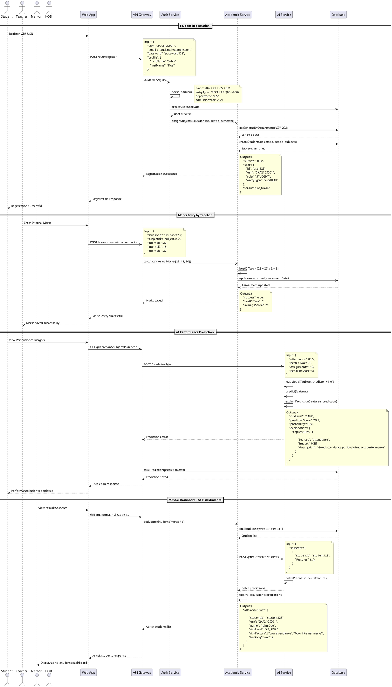
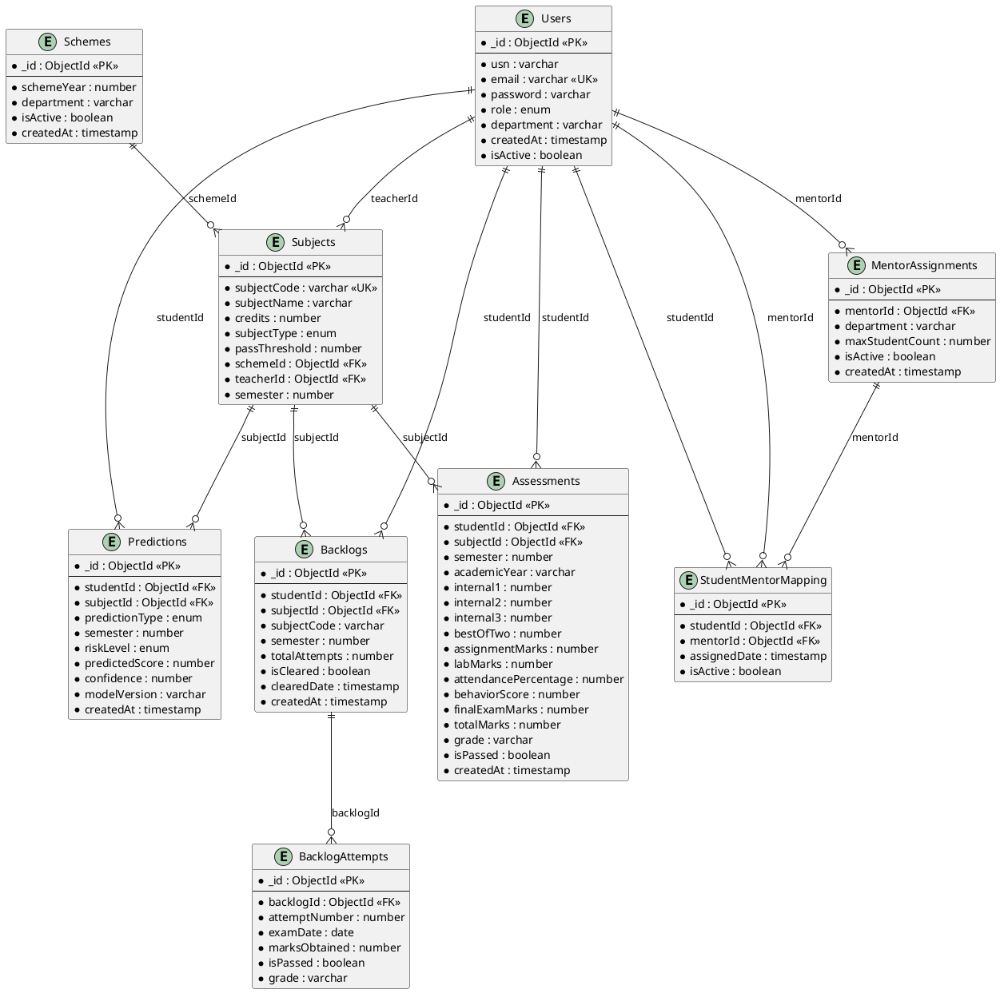

# MentorTrack AI - Web Application System Design & Architecture Document

## Table of Contents
1. [Implementation Approach](#implementation-approach)
2. [Main User-UI Interaction Patterns](#main-user-ui-interaction-patterns)
3. [System Architecture](#system-architecture)
4. [UI Navigation Flow](#ui-navigation-flow)
5. [Database Schema](#database-schema)
6. [Class Diagram](#class-diagram)
7. [Sequence Diagram](#sequence-diagram)
8. [Database ER Diagram](#database-er-diagram)
9. [REST API Endpoints](#rest-api-endpoints)
10. [AI Service Endpoints](#ai-service-endpoints)
11. [UI Layouts & Components](#ui-layouts--components)
12. [Folder Structure](#folder-structure)
13. [Unclear Aspects](#unclear-aspects)

## Implementation Approach

We will implement MentorTrack AI as a comprehensive web-based educational management system with AI-powered performance prediction capabilities:

### Phase 1: Core Infrastructure
1. **Authentication & Authorization System** - JWT-based role management for HOD, Mentor, Subject Teacher, Student
2. **User Management** - Student registration with USN parsing and validation
3. **Database Design** - MongoDB collections for users, subjects, assessments, backlogs
4. **API Foundation** - Express.js REST API with role-based middleware

### Phase 2: Academic Management
1. **Scheme-based Subject System** - Dynamic subject assignment based on department and semester
2. **Dynamic Mentor Assignment** - Automated distribution algorithm for balanced mentor-student allocation
3. **Internal Assessment Logic** - Best of 2 internals calculation with assignment integration
4. **Backlog Tracking System** - Dynamic backlog count management with attempt tracking

### Phase 3: AI Integration
1. **Subject Performance Predictor (Model S)** - ML model using attendance, internals, assignments, behavior
2. **Semester SGPA Predictor (Model O)** - Advanced model incorporating multiple performance indicators
3. **Risk Assessment Engine** - Classification into Safe/Needs Attention/At Risk categories
4. **Feature Explanation System** - SHAP-based explanations for risk predictions

### Phase 4: Web Frontend & Analytics
1. **React.js Web Application** - Responsive web application with modern UI/UX
2. **Role-specific Dashboards** - Customized interfaces for each user role
3. **Analytics & Visualization** - Performance charts and trend analysis using Chart.js/D3.js
4. **Real-time Notifications** - WebSocket-based alert system for at-risk students

### Technology Stack
- **Frontend**: React.js + TypeScript + Tailwind CSS + Vite
- **State Management**: Redux Toolkit + RTK Query
- **Charts & Visualization**: Chart.js + D3.js + Recharts
- **UI Components**: Shadcn/ui + Radix UI
- **Backend API**: Node.js + Express.js + MongoDB + Mongoose
- **AI Service**: Python + FastAPI + scikit-learn/XGBoost + SHAP
- **Authentication**: JWT + bcrypt
- **Database**: MongoDB Atlas
- **Deployment**: Docker + Nginx + AWS/Vercel
- **Testing**: Jest + React Testing Library + Playwright

## Main User-UI Interaction Patterns

### 1. HOD (Head of Department) Interactions
- **Dashboard Access**: View department-wide analytics and performance metrics in responsive grid layout
- **Mentor Management**: Set mentor count, view mentor-student distribution with drag-and-drop interface
- **Scheme Management**: Configure academic schemes and subject mappings with form wizards
- **Performance Monitoring**: Track department performance trends with interactive charts and filters

### 2. Mentor Interactions
- **Student Portfolio**: View assigned students' academic performance in card-based layout with search/filter
- **Risk Assessment**: Monitor at-risk students with AI-powered insights in tabular and chart views
- **Intervention Tracking**: Log mentoring sessions using modal forms with rich text editor
- **Progress Reports**: Generate and export student progress reports with PDF generation

### 3. Subject Teacher Interactions
- **Marks Entry**: Input internal assessment marks using spreadsheet-like interface with bulk operations
- **Attendance Management**: Record and track student attendance with calendar view and bulk marking
- **Performance Analytics**: View subject-wise performance statistics with interactive dashboards
- **Student Insights**: Access AI predictions for individual students with detailed explanations

### 4. Student Interactions
- **Academic Dashboard**: View current semester subjects, marks, and attendance in card-based layout
- **Performance Insights**: Access AI-powered performance predictions with visual recommendations
- **Backlog Tracking**: Monitor backlog subjects and attempt history with progress indicators
- **Progress Visualization**: View academic progress through interactive charts and trend analysis

## System Architecture



## UI Navigation Flow

```plantuml
@startuml
[*] --> Login

state "Login" as Login {
    Login --> HODDashboard : HOD Login
    Login --> MentorDashboard : Mentor Login
    Login --> TeacherDashboard : Teacher Login
    Login --> StudentDashboard : Student Login
}

state "HOD Dashboard" as HODDashboard {
    HODDashboard --> DepartmentAnalytics : View Analytics
    HODDashboard --> MentorManagement : Manage Mentors
    HODDashboard --> SchemeManagement : Manage Schemes
    DepartmentAnalytics --> HODDashboard : Navigate Back
    MentorManagement --> HODDashboard : Navigate Back
    SchemeManagement --> HODDashboard : Navigate Back
}

state "Mentor Dashboard" as MentorDashboard {
    MentorDashboard --> StudentList : View Students
    MentorDashboard --> RiskAnalysis : Risk Assessment
    MentorDashboard --> InterventionLog : Log Interventions
    StudentList --> MentorDashboard : Navigate Back
    RiskAnalysis --> MentorDashboard : Navigate Back
    InterventionLog --> MentorDashboard : Navigate Back
}

state "Teacher Dashboard" as TeacherDashboard {
    TeacherDashboard --> MarksEntry : Enter Marks
    TeacherDashboard --> AttendanceEntry : Mark Attendance
    TeacherDashboard --> SubjectAnalytics : View Analytics
    MarksEntry --> TeacherDashboard : Navigate Back
    AttendanceEntry --> TeacherDashboard : Navigate Back
    SubjectAnalytics --> TeacherDashboard : Navigate Back
}

state "Student Dashboard" as StudentDashboard {
    StudentDashboard --> AcademicProgress : View Progress
    StudentDashboard --> PerformanceInsights : AI Insights
    StudentDashboard --> BacklogStatus : View Backlogs
    AcademicProgress --> StudentDashboard : Navigate Back
    PerformanceInsights --> StudentDashboard : Navigate Back
    BacklogStatus --> StudentDashboard : Navigate Back
}

HODDashboard --> Login : Logout
MentorDashboard --> Login : Logout
TeacherDashboard --> Login : Logout
StudentDashboard --> Login : Logout

@enduml
```



## Database Schema

### MongoDB Collections

#### 1. Users Collection
```javascript
{
  _id: ObjectId,
  usn: String, // For students: "2KA21CS001"
  email: String,
  password: String, // hashed
  role: String, // "HOD", "MENTOR", "TEACHER", "STUDENT"
  profile: {
    firstName: String,
    lastName: String,
    phone: String,
    avatar: String
  },
  department: String, // "CS", "EC", "ME", etc.
  // Student-specific fields
  studentInfo: {
    admissionYear: Number, // 2021
    entryType: String, // "REGULAR", "LATERAL"
    currentSemester: Number,
    mentorId: ObjectId,
    cgpa: Number,
    activeBacklogCount: Number
  },
  // Teacher-specific fields
  teacherInfo: {
    employeeId: String,
    specialization: [String],
    subjectsTeaching: [ObjectId]
  },
  createdAt: Date,
  updatedAt: Date,
  isActive: Boolean
}
```

#### 2. Schemes Collection
```javascript
{
  _id: ObjectId,
  schemeYear: Number, // 2021
  department: String, // "CS"
  semesters: [{
    semesterNumber: Number,
    subjects: [{
      subjectCode: String, // "21CS51"
      subjectName: String, // "Software Engineering"
      credits: Number,
      subjectType: String, // "THEORY", "LAB", "IPCC"
      teacherId: ObjectId,
      passThreshold: Number // 40
    }]
  }],
  createdAt: Date,
  updatedAt: Date,
  isActive: Boolean
}
```

#### 3. Assessments Collection
```javascript
{
  _id: ObjectId,
  studentId: ObjectId,
  subjectId: ObjectId,
  semester: Number,
  academicYear: String, // "2023-24"
  internals: {
    internal1: Number, // out of 25
    internal2: Number,
    internal3: Number,
    bestOfTwo: Number, // calculated
    averageScore: Number // out of 25
  },
  assignments: {
    totalMarks: Number, // out of 20
    submissions: [{
      assignmentName: String,
      marks: Number,
      submittedDate: Date
    }]
  },
  labPerformance: {
    totalMarks: Number, // out of 10 for labs
    practicals: [{
      practicalName: String,
      marks: Number,
      date: Date
    }]
  },
  attendance: {
    totalClasses: Number,
    attendedClasses: Number,
    percentage: Number
  },
  behaviorScore: Number, // out of 10
  finalExamMarks: Number, // out of 100
  totalMarks: Number, // calculated based on subject type
  grade: String, // "S", "A", "B", "C", "D", "F"
  isPassed: Boolean,
  createdAt: Date,
  updatedAt: Date
}
```

#### 4. Backlogs Collection
```javascript
{
  _id: ObjectId,
  studentId: ObjectId,
  subjectId: ObjectId,
  subjectCode: String,
  subjectName: String,
  semester: Number,
  attempts: [{
    attemptNumber: Number,
    examDate: Date,
    marksObtained: Number,
    isPassed: Boolean,
    grade: String
  }],
  isCleared: Boolean,
  clearedDate: Date,
  totalAttempts: Number,
  createdAt: Date,
  updatedAt: Date
}
```

#### 5. MentorAssignments Collection
```javascript
{
  _id: ObjectId,
  mentorId: ObjectId,
  department: String,
  assignedStudents: [ObjectId],
  maxStudentCount: Number,
  regularStudents: [ObjectId],
  lateralStudents: [ObjectId],
  createdAt: Date,
  updatedAt: Date,
  isActive: Boolean
}
```

#### 6. Predictions Collection
```javascript
{
  _id: ObjectId,
  studentId: ObjectId,
  predictionType: String, // "SUBJECT", "SEMESTER"
  subjectId: ObjectId, // null for semester predictions
  semester: Number,
  inputFeatures: {
    attendance: Number,
    bestOfTwo: Number,
    assignments: Number,
    behaviorScore: Number,
    backlogCount: Number,
    previousSgpa: Number
  },
  prediction: {
    riskLevel: String, // "SAFE", "NEEDS_ATTENTION", "AT_RISK"
    probability: Number,
    predictedScore: Number,
    confidence: Number
  },
  explanation: {
    topFeatures: [{
      feature: String,
      impact: Number,
      description: String
    }]
  },
  modelVersion: String,
  createdAt: Date
}
```

## Class Diagram



## Sequence Diagram



## Database ER Diagram



## REST API Endpoints

### Authentication Endpoints
```javascript
POST   /api/auth/register          // User registration
POST   /api/auth/login             // User login
POST   /api/auth/refresh           // Refresh JWT token
POST   /api/auth/logout            // User logout
POST   /api/auth/forgot-password   // Password reset request
POST   /api/auth/reset-password    // Password reset confirmation
```

### User Management Endpoints
```javascript
GET    /api/users/profile          // Get current user profile
PUT    /api/users/profile          // Update user profile
GET    /api/users/{userId}         // Get user by ID (admin only)
GET    /api/users/search           // Search users by criteria
PUT    /api/users/{userId}/status  // Activate/deactivate user
```

### Academic Management Endpoints
```javascript
// Schemes
GET    /api/schemes                // Get all schemes
POST   /api/schemes                // Create new scheme (HOD only)
GET    /api/schemes/{schemeId}     // Get scheme details
PUT    /api/schemes/{schemeId}     // Update scheme (HOD only)

// Subjects
GET    /api/subjects               // Get subjects by filters
POST   /api/subjects               // Create new subject (HOD only)
GET    /api/subjects/{subjectId}   // Get subject details
PUT    /api/subjects/{subjectId}   // Update subject
GET    /api/subjects/student/{studentId} // Get student's subjects
```

### Assessment Endpoints
```javascript
// Internal Assessments
POST   /api/assessments/internals     // Create/update internal marks
GET    /api/assessments/internals/{studentId}/{subjectId} // Get internal marks
PUT    /api/assessments/internals/{assessmentId} // Update internal marks

// Assignments
POST   /api/assessments/assignments   // Create/update assignment marks
GET    /api/assessments/assignments/{studentId}/{subjectId} // Get assignments

// Attendance
POST   /api/assessments/attendance    // Mark attendance
GET    /api/assessments/attendance/{studentId}/{subjectId} // Get attendance
PUT    /api/assessments/attendance/{attendanceId} // Update attendance

// Final Exams
POST   /api/assessments/final-exam    // Enter final exam marks
GET    /api/assessments/final-exam/{studentId}/{subjectId} // Get final marks
```

### Mentor Management Endpoints
```javascript
POST   /api/mentors/assign           // Assign mentors to students (HOD only)
GET    /api/mentors/assignments      // Get mentor assignments
GET    /api/mentors/{mentorId}/students // Get mentor's students
GET    /api/mentors/{mentorId}/at-risk // Get at-risk students
POST   /api/mentors/intervention     // Log mentor intervention
GET    /api/mentors/interventions/{studentId} // Get intervention history
```

### Backlog Management Endpoints
```javascript
GET    /api/backlogs/student/{studentId} // Get student backlogs
POST   /api/backlogs                     // Create backlog entry
PUT    /api/backlogs/{backlogId}/attempt // Add backlog attempt
PUT    /api/backlogs/{backlogId}/clear   // Clear backlog
GET    /api/backlogs/department/{dept}   // Get department backlogs (HOD only)
```

### Analytics Endpoints
```javascript
GET    /api/analytics/department/{dept}     // Department analytics (HOD)
GET    /api/analytics/mentor/{mentorId}     // Mentor analytics
GET    /api/analytics/subject/{subjectId}   // Subject analytics (Teacher)
GET    /api/analytics/student/{studentId}   // Student analytics
GET    /api/analytics/performance-trends    // Performance trends
```

## AI Service Endpoints

### FastAPI AI Service Endpoints
```python
# Subject Performance Prediction
POST   /predict/subject
{
    "student_id": "string",
    "subject_id": "string",
    "features": {
        "attendance_percentage": float,
        "best_of_two_internals": float,
        "assignment_marks": float,
        "behavior_score": float
    }
}

# Semester SGPA Prediction
POST   /predict/semester
{
    "student_id": "string",
    "semester": int,
    "features": {
        "mean_subject_prediction": float,
        "active_backlog_count": int,
        "previous_sgpa": float,
        "attendance_average": float
    }
}

# Batch Prediction for Multiple Students
POST   /predict/batch
{
    "students": [
        {
            "student_id": "string",
            "features": {...}
        }
    ],
    "prediction_type": "subject" | "semester"
}

# Model Explanation
POST   /explain/prediction
{
    "prediction_id": "string",
    "features": {...}
}

# Model Performance Metrics
GET    /models/performance
GET    /models/performance/{model_name}

# Model Retraining
POST   /models/retrain
{
    "model_name": "string",
    "training_data_path": "string"
}
```

## UI Layouts & Components

### 1. HOD Dashboard Layout (Web Responsive)
```
┌─────────────────────────────────────────────────────────────────────────────────┐
│ Header: MentorTrack AI - HOD Dashboard                    [Profile] [Logout]    │
├─────────────────────────────────────────────────────────────────────────────────┤
│ Sidebar Navigation:                     Main Content Area                       │
│ ├── Dashboard                          ┌─────────────────────────────────────┐   │
│ ├── Mentors                            │ Key Metrics Cards (Responsive Grid) │   │
│ ├── Schemes                            │ ┌─────────┐ ┌─────────┐ ┌─────────┐ │   │
│ ├── Analytics                          │ │ Total   │ │ Active  │ │ At Risk │ │   │
│ └── Reports                            │ │Students │ │ Mentors │ │ Count   │ │   │
│                                        │ │ 1,250   │ │   25    │ │   87    │ │   │
│                                        │ └─────────┘ └─────────┘ └─────────┘ │   │
│                                        └─────────────────────────────────────┘   │
│                                        ┌─────────────────────────────────────┐   │
│                                        │ Interactive Performance Charts      │   │
│                                        │ [Chart.js Bar/Line Charts]          │   │
│                                        │ - Department Performance Trends     │   │
│                                        │ - Semester-wise SGPA Distribution   │   │
│                                        └─────────────────────────────────────┘   │
│                                        ┌─────────────────────────────────────┐   │
│                                        │ Data Table: Mentor Assignments      │   │
│                                        │ [Sortable, Filterable, Paginated]   │   │
│                                        │ Mentor | Assigned | Capacity | Actions│   │
│                                        │ Dr.Smith│  45/50  │   90%   │ [View] │   │
│                                        └─────────────────────────────────────┘   │
└─────────────────────────────────────────────────────────────────────────────────┘
```

### 2. Mentor Dashboard Layout (Web Responsive)
```
┌─────────────────────────────────────────────────────────────────────────────────┐
│ Header: MentorTrack AI - Mentor Dashboard                 [Profile] [Logout]    │
├─────────────────────────────────────────────────────────────────────────────────┤
│ Sidebar Navigation:                     Main Content Area                       │
│ ├── Dashboard                          ┌─────────────────────────────────────┐   │
│ ├── My Students                        │ Alert Cards (At-Risk Students)      │   │
│ ├── Risk Analysis                      │ ┌─────────────────────────────────┐ │   │
│ ├── Interventions                      │ │ 🚨 High Priority Alerts         │ │   │
│ └── Reports                            │ │ John Doe (2KA21CS001) - AT RISK │ │   │
│                                        │ │ Jane Smith (2KA21CS015) - ATTN  │ │   │
│                                        │ └─────────────────────────────────┘ │   │
│                                        └─────────────────────────────────────┘   │
│                                        ┌─────────────────────────────────────┐   │
│                                        │ Student Performance Overview        │   │
│                                        │ [Interactive Charts with Filters]   │   │
│                                        │ - Risk Level Distribution           │   │
│                                        │ - Performance Trends Over Time      │   │
│                                        └─────────────────────────────────────┘   │
│                                        ┌─────────────────────────────────────┐   │
│                                        │ Student List with Search & Filter   │   │
│                                        │ [Search Box] [Filter Dropdowns]     │   │
│                                        │ USN | Name | Risk | Actions         │   │
│                                        │ 001 | John | AT_RISK | [Contact]    │   │
│                                        └─────────────────────────────────────┘   │
└─────────────────────────────────────────────────────────────────────────────────┘
```

### 3. Teacher Marks Entry Layout (Web Responsive)
```
┌─────────────────────────────────────────────────────────────────────────────────┐
│ Header: MentorTrack AI - Marks Entry                      [Profile] [Logout]    │
├─────────────────────────────────────────────────────────────────────────────────┤
│ Subject Selection Bar:                                                          │
│ [Dropdown: Software Engineering (21CS51)] [Semester: 5] [Academic Year: 2023-24]│
├─────────────────────────────────────────────────────────────────────────────────┤
│ Marks Entry Interface (Spreadsheet-like):                                      │
│ ┌─────────────────────────────────────────────────────────────────────────────┐ │
│ │ [Bulk Actions] [Import CSV] [Export] [Save All]                             │ │
│ │ ┌─────┬─────────────┬─────┬─────┬─────┬─────┬─────┬─────────────────────┐   │ │
│ │ │ USN │ Student Name│ IA1 │ IA2 │ IA3 │ Asn │ Att │ Actions             │   │ │
│ │ ├─────┼─────────────┼─────┼─────┼─────┼─────┼─────┼─────────────────────┤   │ │
│ │ │ 001 │ John Doe    │ [22]│ [18]│ [20]│ [18]│ 87% │ [Save] [View Detail]│   │ │
│ │ │ 002 │ Jane Smith  │ [25]│ [23]│ [24]│ [19]│ 92% │ [Save] [View Detail]│   │ │
│ │ └─────┴─────────────┴─────┴─────┴─────┴─────┴─────┴─────────────────────┘   │ │
│ └─────────────────────────────────────────────────────────────────────────────┘ │
├─────────────────────────────────────────────────────────────────────────────────┤
│ Quick Actions Panel:                                                            │
│ ┌─────────────────────────────────────────────────────────────────────────────┐ │
│ │ Attendance Marking: [Date Picker] [Class Type] [Mark All Present/Absent]    │ │
│ │ Analytics: [View Subject Performance] [Generate Report] [Export Data]       │ │
│ └─────────────────────────────────────────────────────────────────────────────┘ │
└─────────────────────────────────────────────────────────────────────────────────┘
```

### 4. Student Dashboard Layout (Web Responsive)
```
┌─────────────────────────────────────────────────────────────────────────────────┐
│ Header: MentorTrack AI - Student Portal                   [Profile] [Logout]    │
│ Welcome, John Doe (2KA21CS001) | Semester: 5 | CGPA: 8.2                      │
├─────────────────────────────────────────────────────────────────────────────────┤
│ Dashboard Grid Layout:                                                          │
│ ┌─────────────────┐ ┌─────────────────┐ ┌─────────────────┐ ┌─────────────────┐ │
│ │ Current Sem     │ │ Attendance      │ │ Backlogs        │ │ AI Insights     │ │
│ │ SGPA: 8.5       │ │ Average: 87%    │ │ Count: 1        │ │ Risk: SAFE ✅   │ │
│ │ [View Details]  │ │ [View Calendar] │ │ [View Details]  │ │ [View Report]   │ │
│ └─────────────────┘ └─────────────────┘ └─────────────────┘ └─────────────────┘ │
├─────────────────────────────────────────────────────────────────────────────────┤
│ AI Performance Insights Panel:                                                 │
│ ┌─────────────────────────────────────────────────────────────────────────────┐ │
│ │ 🤖 AI-Powered Performance Analysis                                          │ │
│ │ ┌─────────────────────────────────────────────────────────────────────────┐ │ │
│ │ │ Risk Assessment: SAFE ✅ | Predicted Semester SGPA: 8.3                │ │ │
│ │ │ ┌─────────────────────────────────────────────────────────────────────┐ │ │ │
│ │ │ │ Key Recommendations:                                                │ │ │ │
│ │ │ │ • Maintain excellent attendance (87% is above average)             │ │ │ │
│ │ │ │ • Focus improvement on Data Structures subject                     │ │ │ │
│ │ │ │ • Clear pending backlog in Mathematics-III                         │ │ │ │
│ │ │ │ • Continue current study pattern for optimal results               │ │ │ │
│ │ │ └─────────────────────────────────────────────────────────────────────┘ │ │ │
│ │ └─────────────────────────────────────────────────────────────────────────┘ │ │
│ └─────────────────────────────────────────────────────────────────────────────┘ │
├─────────────────────────────────────────────────────────────────────────────────┤
│ Subject Performance Visualization:                                             │
│ ┌─────────────────────────────────────────────────────────────────────────────┐ │
│ │ [Interactive Charts - Chart.js/D3.js]                                      │ │
│ │ - Subject-wise Performance Radar Chart                                     │ │
│ │ - Attendance Trends Line Chart                                             │ │
│ │ - Grade Distribution Bar Chart                                             │ │
│ └─────────────────────────────────────────────────────────────────────────────┘ │
└─────────────────────────────────────────────────────────────────────────────────┘
```

## Folder Structure

```
mentortrack-ai-web/
├── README.md
├── LICENSE
├── .gitignore
├── docker-compose.yml
├── docker-compose.prod.yml
├── .env.example
├── package.json
├── 
├── backend/                              # Node.js Express API Server
│   ├── src/
│   │   ├── app.js                        # Main application entry point
│   │   ├── server.js                     # Server configuration and startup
│   │   ├── 
│   │   ├── config/                       # Configuration files
│   │   │   ├── database.js               # MongoDB connection config
│   │   │   ├── redis.js                  # Redis cache configuration
│   │   │   ├── environment.js            # Environment variables handler
│   │   │   ├── jwt.js                    # JWT configuration
│   │   │   └── constants.js              # Application constants
│   │   ├── 
│   │   ├── controllers/                  # Request handlers
│   │   │   ├── authController.js         # Authentication endpoints
│   │   │   ├── userController.js         # User management endpoints
│   │   │   ├── academicController.js     # Academic data endpoints
│   │   │   ├── assessmentController.js   # Assessment management
│   │   │   ├── mentorController.js       # Mentor assignment endpoints
│   │   │   ├── backlogController.js      # Backlog management
│   │   │   ├── analyticsController.js    # Analytics and reporting
│   │   │   └── predictionController.js   # AI prediction endpoints
│   │   ├── 
│   │   ├── models/                       # Mongoose schemas
│   │   │   ├── User.js                   # User model with role-based fields
│   │   │   ├── Scheme.js                 # Academic scheme model
│   │   │   ├── Subject.js                # Subject model
│   │   │   ├── Assessment.js             # Assessment model
│   │   │   ├── Backlog.js                # Backlog tracking model
│   │   │   ├── MentorAssignment.js       # Mentor-student mapping
│   │   │   ├── Prediction.js             # AI prediction results
│   │   │   ├── Intervention.js           # Mentor intervention logs
│   │   │   ├── AttendanceRecord.js       # Daily attendance records
│   │   │   ├── Assignment.js             # Assignment details
│   │   │   └── AssignmentSubmission.js   # Student submissions
│   │   ├── 
│   │   ├── services/                     # Business logic layer
│   │   │   ├── authService.js            # Authentication business logic
│   │   │   ├── userService.js            # User management logic
│   │   │   ├── academicService.js        # Academic operations
│   │   │   ├── assessmentService.js      # Assessment calculations
│   │   │   ├── mentorService.js          # Mentor assignment logic
│   │   │   ├── backlogService.js         # Backlog management logic
│   │   │   ├── aiService.js              # AI service integration
│   │   │   ├── analyticsService.js       # Analytics generation
│   │   │   ├── emailService.js           # Email notifications
│   │   │   ├── websocketService.js       # Real-time notifications
│   │   │   └── cacheService.js           # Redis caching operations
│   │   ├── 
│   │   ├── middleware/                   # Express middleware
│   │   │   ├── auth.js                   # JWT authentication middleware
│   │   │   ├── roleCheck.js              # Role-based access control
│   │   │   ├── validation.js             # Request validation middleware
│   │   │   ├── rateLimiter.js            # API rate limiting
│   │   │   ├── errorHandler.js           # Global error handling
│   │   │   ├── cors.js                   # CORS configuration
│   │   │   └── logger.js                 # Request logging middleware
│   │   ├── 
│   │   ├── routes/                       # API route definitions
│   │   │   ├── index.js                  # Main router
│   │   │   ├── auth.js                   # Authentication routes
│   │   │   ├── users.js                  # User management routes
│   │   │   ├── academic.js               # Academic data routes
│   │   │   ├── assessments.js            # Assessment routes
│   │   │   ├── mentors.js                # Mentor management routes
│   │   │   ├── backlogs.js               # Backlog routes
│   │   │   ├── analytics.js              # Analytics routes
│   │   │   └── predictions.js            # AI prediction routes
│   │   ├── 
│   │   ├── utils/                        # Utility functions
│   │   │   ├── usnParser.js              # USN parsing and validation
│   │   │   ├── gradeCalculator.js        # Grade calculation utilities
│   │   │   ├── mentorAssigner.js         # Mentor assignment algorithm
│   │   │   ├── dateHelper.js             # Date manipulation utilities
│   │   │   ├── validators.js             # Data validation functions
│   │   │   ├── encryption.js             # Password hashing utilities
│   │   │   └── responseFormatter.js      # API response formatting
│   │   ├── 
│   │   └── seeders/                      # Database seeding scripts
│   │       ├── userSeeder.js             # Sample users data
│   │       ├── schemeSeeder.js           # Academic schemes data
│   │       ├── subjectSeeder.js          # Subjects data
│   │       └── seedDatabase.js           # Main seeding script
│   ├── 
│   ├── tests/                            # Test suites
│   │   ├── unit/                         # Unit tests
│   │   ├── integration/                  # Integration tests
│   │   └── e2e/                          # End-to-end tests
│   ├── 
│   ├── package.json                      # Node.js dependencies
│   ├── Dockerfile                        # Docker configuration
│   └── .env.example                      # Environment variables template
├── 
├── ai-service/                           # Python FastAPI AI Service
│   ├── src/
│   │   ├── main.py                       # FastAPI application entry point
│   │   ├── 
│   │   ├── models/                       # ML models
│   │   │   ├── __init__.py
│   │   │   ├── subject_predictor.py      # Subject performance prediction
│   │   │   ├── sgpa_predictor.py         # Semester SGPA prediction
│   │   │   ├── model_trainer.py          # Model training pipeline
│   │   │   ├── model_evaluator.py        # Model evaluation metrics
│   │   │   └── base_model.py             # Base ML model class
│   │   ├── 
│   │   ├── services/                     # Business logic services
│   │   │   ├── __init__.py
│   │   │   ├── prediction_service.py     # Prediction orchestration
│   │   │   ├── explanation_service.py    # SHAP-based explanations
│   │   │   ├── model_service.py          # Model management
│   │   │   ├── feature_service.py        # Feature engineering
│   │   │   └── validation_service.py     # Input validation
│   │   ├── 
│   │   ├── utils/                        # Utility functions
│   │   │   ├── __init__.py
│   │   │   ├── feature_engineering.py    # Feature transformation
│   │   │   ├── data_preprocessing.py     # Data cleaning and prep
│   │   │   ├── model_evaluation.py       # Model performance metrics
│   │   │   ├── config.py                 # Configuration management
│   │   │   └── logger.py                 # Logging configuration
│   │   ├── 
│   │   ├── api/                          # API route handlers
│   │   │   ├── __init__.py
│   │   │   ├── prediction_routes.py      # Prediction endpoints
│   │   │   ├── model_routes.py           # Model management endpoints
│   │   │   ├── health_routes.py          # Health check endpoints
│   │   │   └── batch_routes.py           # Batch prediction endpoints
│   │   ├── 
│   │   └── schemas/                      # Pydantic data models
│   │       ├── __init__.py
│   │       ├── prediction_schemas.py     # Prediction request/response
│   │       ├── feature_schemas.py        # Feature data models
│   │       └── model_schemas.py          # Model metadata schemas
│   ├── 
│   ├── data/                             # Data storage
│   │   ├── models/                       # Trained model files
│   │   ├── training/                     # Training datasets
│   │   └── validation/                   # Validation datasets
│   ├── 
│   ├── requirements.txt                  # Python dependencies
│   ├── Dockerfile                        # Docker configuration
│   └── .env.example                      # Environment variables template
├── 
├── web-app/                              # React.js Web Application
│   ├── public/
│   │   ├── index.html                    # Main HTML template
│   │   ├── favicon.ico                   # App favicon
│   │   ├── manifest.json                 # PWA manifest
│   │   └── robots.txt                    # SEO robots file
│   ├── 
│   ├── src/
│   │   ├── App.tsx                       # Main application component
│   │   ├── index.tsx                     # Application entry point
│   │   ├── 
│   │   ├── pages/                        # Page components (route-based)
│   │   │   ├── auth/                     # Authentication pages
│   │   │   │   ├── LoginPage.tsx         # Login page
│   │   │   │   ├── RegisterPage.tsx      # Registration page
│   │   │   │   └── ForgotPasswordPage.tsx
│   │   │   ├── 
│   │   │   ├── hod/                      # HOD role pages
│   │   │   │   ├── HODDashboard.tsx      # HOD main dashboard
│   │   │   │   ├── MentorManagement.tsx  # Mentor assignment interface
│   │   │   │   ├── SchemeManagement.tsx  # Academic scheme management
│   │   │   │   ├── DepartmentAnalytics.tsx # Department performance
│   │   │   │   └── StudentOverview.tsx   # Student overview
│   │   │   ├── 
│   │   │   ├── mentor/                   # Mentor role pages
│   │   │   │   ├── MentorDashboard.tsx   # Mentor main dashboard
│   │   │   │   ├── StudentList.tsx       # Assigned students list
│   │   │   │   ├── RiskAnalysis.tsx      # At-risk students analysis
│   │   │   │   ├── InterventionLog.tsx   # Intervention tracking
│   │   │   │   └── StudentProfile.tsx    # Individual student details
│   │   │   ├── 
│   │   │   ├── teacher/                  # Teacher role pages
│   │   │   │   ├── TeacherDashboard.tsx  # Teacher main dashboard
│   │   │   │   ├── MarksEntry.tsx        # Marks entry interface
│   │   │   │   ├── AttendanceEntry.tsx   # Attendance marking
│   │   │   │   ├── SubjectAnalytics.tsx  # Subject performance analytics
│   │   │   │   └── StudentProgress.tsx   # Student progress tracking
│   │   │   ├── 
│   │   │   └── student/                  # Student role pages
│   │   │       ├── StudentDashboard.tsx  # Student main dashboard
│   │   │       ├── PerformanceInsights.tsx # AI-powered insights
│   │   │       ├── BacklogStatus.tsx     # Backlog tracking
│   │   │       ├── AttendanceView.tsx    # Attendance overview
│   │   │       ├── MarksView.tsx         # Marks and grades view
│   │   │       └── SubjectDetails.tsx    # Individual subject details
│   │   ├── 
│   │   ├── components/                   # Reusable components
│   │   │   ├── layout/                   # Layout components
│   │   │   │   ├── Header.tsx            # App header component
│   │   │   │   ├── Sidebar.tsx           # Navigation sidebar
│   │   │   │   ├── Footer.tsx            # App footer
│   │   │   │   ├── Layout.tsx            # Main layout wrapper
│   │   │   │   └── Breadcrumb.tsx        # Breadcrumb navigation
│   │   │   ├── 
│   │   │   ├── ui/                       # UI components (Shadcn/ui)
│   │   │   │   ├── Button.tsx            # Button component
│   │   │   │   ├── Input.tsx             # Input field component
│   │   │   │   ├── Card.tsx              # Card layout component
│   │   │   │   ├── Modal.tsx             # Modal dialog component
│   │   │   │   ├── Table.tsx             # Data table component
│   │   │   │   ├── Badge.tsx             # Badge component
│   │   │   │   ├── Alert.tsx             # Alert component
│   │   │   │   └── LoadingSpinner.tsx    # Loading indicator
│   │   │   ├── 
│   │   │   ├── charts/                   # Chart components
│   │   │   │   ├── PerformanceChart.tsx  # Performance visualization
│   │   │   │   ├── AttendanceChart.tsx   # Attendance trends
│   │   │   │   ├── TrendChart.tsx        # General trend visualization
│   │   │   │   ├── RiskLevelChart.tsx    # Risk level distribution
│   │   │   │   ├── SGPAChart.tsx         # SGPA progression chart
│   │   │   │   └── RadarChart.tsx        # Subject performance radar
│   │   │   ├── 
│   │   │   ├── forms/                    # Form components
│   │   │   │   ├── MarksEntryForm.tsx    # Marks entry form
│   │   │   │   ├── AttendanceForm.tsx    # Attendance form
│   │   │   │   ├── StudentRegistrationForm.tsx # Registration form
│   │   │   │   ├── SubjectForm.tsx       # Subject creation form
│   │   │   │   ├── InterventionForm.tsx  # Intervention logging form
│   │   │   │   └── SearchForm.tsx        # Search and filter form
│   │   │   ├── 
│   │   │   └── data/                     # Data display components
│   │   │       ├── StudentList.tsx       # Student list component
│   │   │       ├── SubjectList.tsx       # Subject list component
│   │   │       ├── BacklogList.tsx       # Backlog list component
│   │   │       ├── AtRiskList.tsx        # At-risk students list
│   │   │       ├── DataTable.tsx         # Generic data table
│   │   │       └── StatCard.tsx          # Statistics card component
│   │   ├── 
│   │   ├── services/                     # API and external services
│   │   │   ├── api.ts                    # Base API configuration (Axios)
│   │   │   ├── authService.ts            # Authentication API calls
│   │   │   ├── userService.ts            # User management API
│   │   │   ├── academicService.ts        # Academic data API
│   │   │   ├── assessmentService.ts      # Assessment API
│   │   │   ├── mentorService.ts          # Mentor management API
│   │   │   ├── backlogService.ts         # Backlog API
│   │   │   ├── aiService.ts              # AI prediction API
│   │   │   ├── analyticsService.ts       # Analytics API
│   │   │   └── websocketService.ts       # WebSocket connection
│   │   ├── 
│   │   ├── store/                        # Redux state management
│   │   │   ├── store.ts                  # Redux store configuration
│   │   │   ├── rootReducer.ts            # Root reducer
│   │   │   ├── 
│   │   │   └── slices/                   # Redux Toolkit slices
│   │   │       ├── authSlice.ts          # Authentication state
│   │   │       ├── userSlice.ts          # User data state
│   │   │       ├── academicSlice.ts      # Academic data state
│   │   │       ├── assessmentSlice.ts    # Assessment state
│   │   │       ├── mentorSlice.ts        # Mentor data state
│   │   │       ├── backlogSlice.ts       # Backlog state
│   │   │       ├── predictionSlice.ts    # AI prediction state
│   │   │       └── uiSlice.ts            # UI state management
│   │   ├── 
│   │   ├── hooks/                        # Custom React hooks
│   │   │   ├── useAuth.ts                # Authentication hook
│   │   │   ├── useApi.ts                 # API calling hook
│   │   │   ├── usePermissions.ts         # Permission checking hook
│   │   │   ├── useDebounce.ts            # Debouncing hook
│   │   │   ├── useLocalStorage.ts        # Local storage hook
│   │   │   ├── useWebSocket.ts           # WebSocket hook
│   │   │   └── useResponsive.ts          # Responsive design hook
│   │   ├── 
│   │   ├── utils/                        # Utility functions
│   │   │   ├── constants.ts              # App constants
│   │   │   ├── helpers.ts                # Helper functions
│   │   │   ├── validators.ts             # Validation functions
│   │   │   ├── formatters.ts             # Data formatting utilities
│   │   │   ├── dateUtils.ts              # Date manipulation utilities
│   │   │   ├── gradeUtils.ts             # Grade calculation utilities
│   │   │   ├── permissions.ts            # Permission checking utilities
│   │   │   ├── exportUtils.ts            # Data export utilities
│   │   │   └── chartUtils.ts             # Chart configuration utilities
│   │   ├── 
│   │   ├── types/                        # TypeScript type definitions
│   │   │   ├── auth.ts                   # Authentication types
│   │   │   ├── user.ts                   # User data types
│   │   │   ├── academic.ts               # Academic data types
│   │   │   ├── assessment.ts             # Assessment types
│   │   │   ├── mentor.ts                 # Mentor types
│   │   │   ├── backlog.ts                # Backlog types
│   │   │   ├── prediction.ts             # AI prediction types
│   │   │   ├── chart.ts                  # Chart data types
│   │   │   └── api.ts                    # API response types
│   │   ├── 
│   │   ├── styles/                       # Styling and themes
│   │   │   ├── globals.css               # Global CSS styles
│   │   │   ├── components.css            # Component-specific styles
│   │   │   ├── variables.css             # CSS custom properties
│   │   │   └── responsive.css            # Responsive design styles
│   │   ├── 
│   │   └── assets/                       # Static assets
│   │       ├── images/                   # Image assets
│   │       │   ├── logo.svg
│   │       │   ├── icons/
│   │       │   └── backgrounds/
│   │       └── fonts/                    # Custom fonts
│   ├── 
│   ├── __tests__/                        # Test files
│   │   ├── components/                   # Component tests
│   │   ├── pages/                        # Page tests
│   │   ├── services/                     # Service tests
│   │   ├── utils/                        # Utility tests
│   │   ├── __mocks__/                    # Mock files
│   │   └── setup.ts                      # Test setup configuration
│   ├── 
│   ├── package.json                      # React dependencies
│   ├── package-lock.json
│   ├── vite.config.ts                    # Vite configuration
│   ├── tsconfig.json                     # TypeScript configuration
│   ├── tailwind.config.js                # Tailwind CSS configuration
│   ├── postcss.config.js                 # PostCSS configuration
│   ├── jest.config.js                    # Jest testing configuration
│   ├── .eslintrc.js                      # ESLint configuration
│   ├── .prettierrc                       # Prettier configuration
│   └── Dockerfile                        # Docker configuration
├── 
├── shared/                               # Shared utilities and types
│   ├── types/                            # Shared TypeScript types
│   │   ├── common.ts
│   │   ├── api.ts
│   │   └── models.ts
│   ├── utils/                            # Shared utility functions
│   │   ├── constants.ts
│   │   ├── validators.ts
│   │   └── formatters.ts
│   └── package.json
├── 
├── docs/                                 # Documentation
│   ├── api/                              # API documentation
│   ├── deployment/                       # Deployment guides
│   ├── user-guides/                      # User documentation
│   ├── development/                      # Development guides
│   └── architecture/                     # Architecture documentation
├── 
├── scripts/                              # Utility scripts
│   ├── setup/                            # Setup scripts
│   ├── deployment/                       # Deployment scripts
│   ├── maintenance/                      # Maintenance scripts
│   └── testing/                          # Testing scripts
├── 
├── infrastructure/                       # Infrastructure as Code
│   ├── terraform/                        # Terraform configurations
│   ├── kubernetes/                       # Kubernetes manifests
│   ├── nginx/                            # Nginx configuration
│   │   ├── nginx.conf                    # Main Nginx config
│   │   └── sites-available/              # Site configurations
│   └── monitoring/                       # Monitoring configurations
├── 
└── .github/                              # GitHub configurations
    ├── workflows/                        # GitHub Actions
    │   ├── ci-backend.yml
    │   ├── ci-ai-service.yml
    │   ├── ci-web-app.yml
    │   ├── deploy-staging.yml
    │   └── deploy-production.yml
    ├── ISSUE_TEMPLATE/
    └── pull_request_template.md
```

## Unclear Aspects

### Technical Clarifications Needed

1. **Pass Threshold Configuration**
   - Are pass thresholds subject-specific or uniform across all subjects?
   - Should pass thresholds be configurable by HOD or fixed system-wide?

2. **Mentor Assignment Algorithm**
   - Should the system consider mentor expertise/department specialization?
   - How should the system handle mentor unavailability or capacity changes?

3. **AI Model Training Data**
   - What historical data sources are available for initial model training?
   - How frequently should models be retrained with new data?

4. **Behavior Score Calculation**
   - What specific criteria determine the behavior score (1-10)?
   - Who is responsible for updating behavior scores?

5. **Real-time vs Batch Processing**
   - Should AI predictions be generated in real-time or through scheduled batch jobs?
   - What's the acceptable latency for prediction requests?

6. **Web Application Deployment**
   - Should the web app be deployed as a Single Page Application (SPA) or Server-Side Rendered (SSR)?
   - What are the browser compatibility requirements?

### Business Logic Clarifications

1. **Academic Calendar Integration**
   - How should the system handle semester transitions and academic year changes?
   - Should there be automatic semester progression for students?

2. **Backlog Attempt Limits**
   - Is there a maximum number of attempts allowed per backlog subject?
   - What happens when a student exceeds attempt limits?

3. **Grade Point Calculation**
   - What's the specific formula for SGPA and CGPA calculation?
   - How should the system handle grade point variations across different schemes?

4. **Multi-Department Support**
   - Should the system support cross-department subject enrollment?
   - How should inter-departmental mentor assignments be handled?

5. **Web-Specific Features**
   - Should the web app support offline functionality with service workers?
   - What level of responsive design is required (mobile, tablet, desktop)?

### Assumptions Made

1. **USN Format**: Assuming USN format is strictly "2KA" + 2-digit year + 2-character department + 3-digit serial
2. **Grading System**: Assuming standard 10-point grading scale (S=10, A=9, B=8, C=7, D=6, F=0)
3. **Academic Structure**: Assuming 8-semester engineering program structure
4. **Data Retention**: Assuming all academic data should be retained indefinitely for analytics
5. **Web-First Design**: Assuming primary usage will be through web browsers with responsive design for mobile access
6. **Modern Browser Support**: Assuming support for modern browsers (Chrome 90+, Firefox 88+, Safari 14+, Edge 90+)

### Recommended Next Steps

1. **Stakeholder Validation**: Review and validate all assumptions with actual users (HOD, mentors, teachers, students)
2. **Data Analysis**: Analyze existing academic data to understand patterns and refine AI model requirements
3. **Pilot Implementation**: Start with a single department pilot to validate the web application design
4. **Performance Testing**: Conduct load testing to ensure system can handle concurrent web users during peak times
5. **Security Audit**: Implement comprehensive security measures for protecting sensitive academic data
6. **Accessibility Compliance**: Ensure web application meets WCAG 2.1 AA accessibility standards